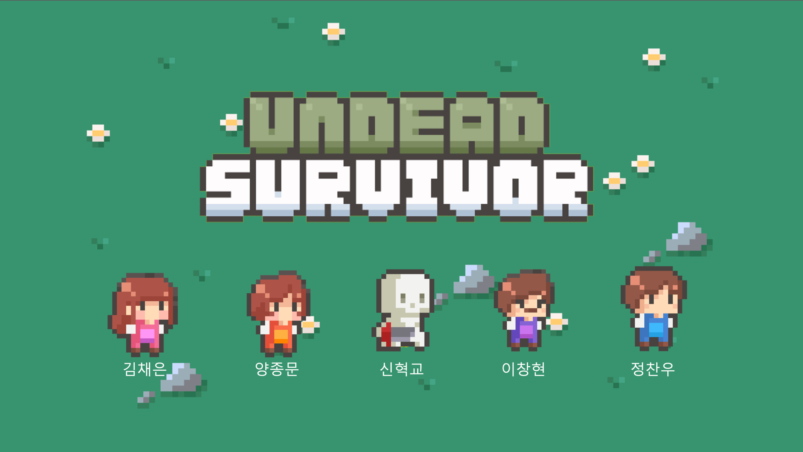
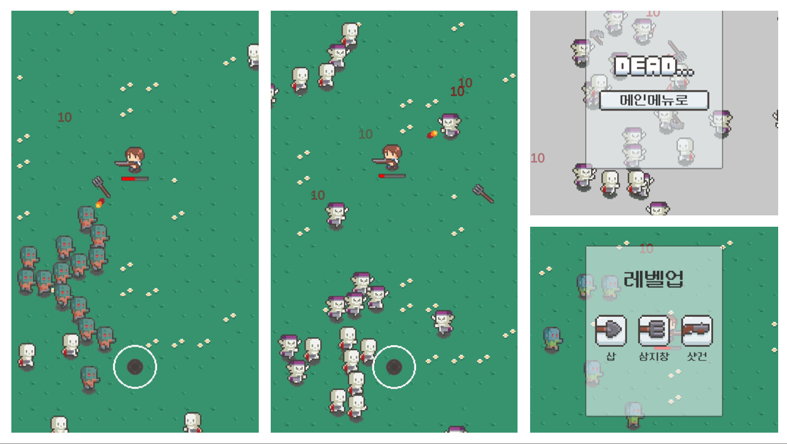

# Undead Survivor

### Abstract  
EOS Undead Survival 팀의 게임 `Undead Survivor`입니다. 2023년도 1월 EOS 학술제에서 발표한 작품입니다.  
액션, 캐주얼, 탄막 슈팅, 핵 앤 슬래시 장르의 게임으로 `Vampire Survivors`를 모방한 `탕탕특공대`를 모방한 게임 `Undead Survivor`를 제작하였습니다.
이 프로젝트는 unity를 다루는 방법을 배우는 목적으로 제작되었습니다. 

### How to make
참조한 채널: [Goldmetal youtube](https://www.youtube.com/@goldmetal)  
사용한 에셋: [Undead Survivor Asset Pack](https://assetstore.unity.com/packages/2d/undead-survivor-assets-pack-238068)  
채널에 올라가 있는 영상을 참고하여 몬스터 스폰까지 구현한 뒤 플레이어 공격 이후부터는 직접 제작하였습니다.

### Screenshots

최종 결과 학술제 3등으로 종료!
